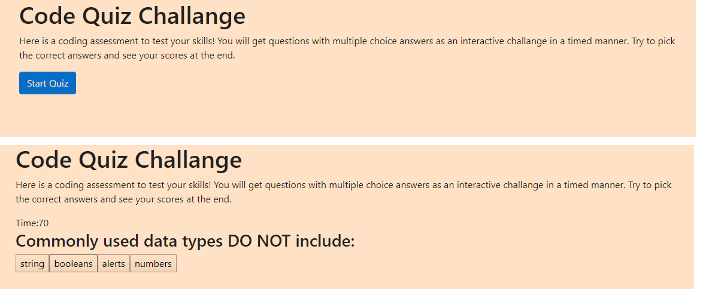

# Web APIs: Code Quiz

A coding quiz web application; a combination of multiple-choice questions and interactive challenges. Built a timed code quiz with multiple-choice questions. This app runs in the browser and features dynamically updated HTML and CSS powered by JavaScript code. It has a clean user interface and it is responsive, ensuring that it adapts to multiple screen sizes.

## User Story

AS A coding bootcamp student
I WANT to take a timed quiz on JavaScript fundamentals that stores high scores
SO THAT I can gauge my progress compared to my peers

### Walkthrough 

GIVEN I am taking a code quiz
WHEN I click the start button
THEN a timer starts and I am presented with a question
WHEN I answer a question
THEN I am presented with another question
WHEN I answer a question incorrectly
THEN time is subtracted from the clock
WHEN all questions are answered or the timer reaches 0
THEN the game is over
WHEN the game is over
THEN I can save my initials and score

Here is a screenshot from the actual application:

The following animation demonstrates the application functionality:

